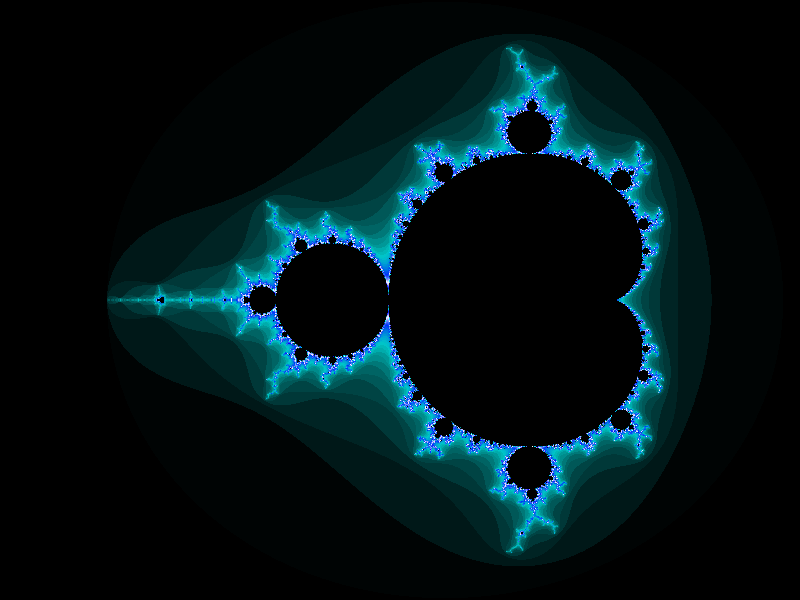
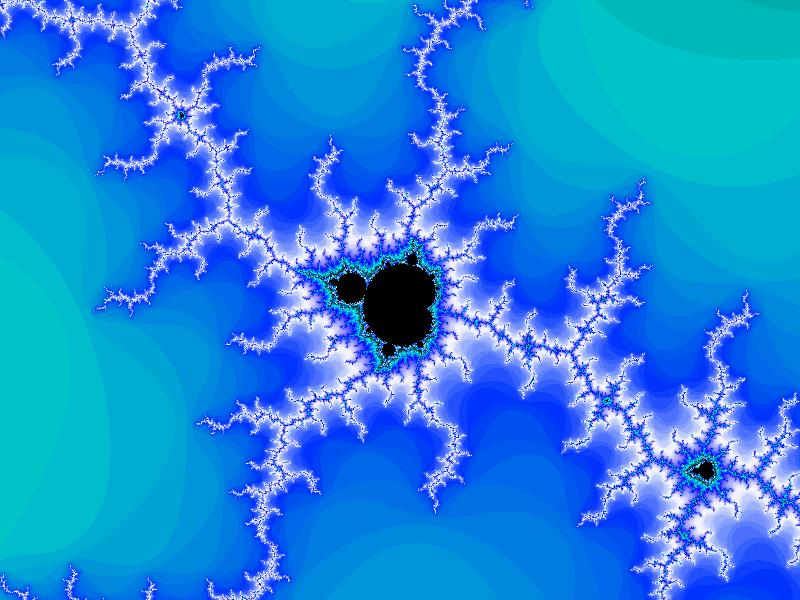
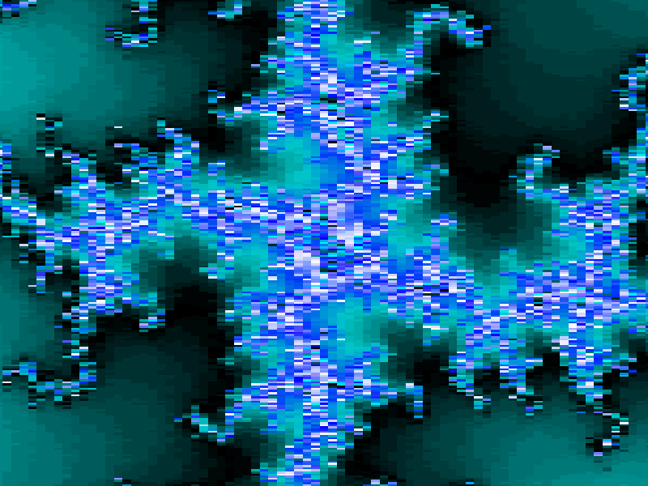

# fractal-glenator
Another fractal generation program, this time using OpenGL.

    

## Dependencies

All the dependencies are included in this repository, so, besides `cmake`, you shouldn't need to install any third-party dependencies.

## Running the project

The project can be directly built and ran using `./build.sh`.

## Features

Currently, you can

- Zoom in/out of the fractal using the mouse wheel
- Move around by dragging your mouse across the screen

Also, you can exit out of the program by either pressing `Esc` or `Q` on your keyboard.

    

## Limitations

Since `float`s are used, only a zoom of about a factor 10000 is achievable before the fractal becomes visibly pixelated. This can be addressed by using `double`s instead, or arbitrary precision floats. However, I will not implement this for this project.

    

